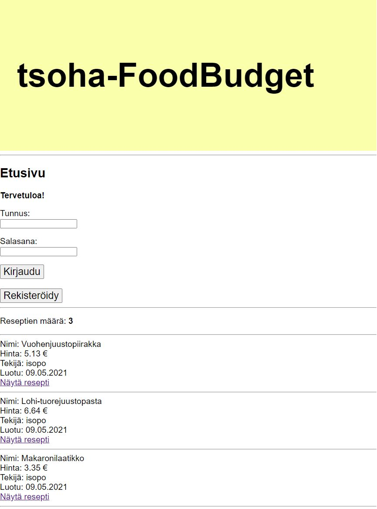

# tsoha-FoodBudget

Sovelluksen auttaa ruuan budjetoinnissa ja reseptien tekemisessä. Sovelluksesta näkee kaikki siellä olevat reseptit ja niiden hinnat helposti. Käyttäjät voivat lisätä näitä reseptejä, sekä ruoka-aineita, joista muut käyttäjät voivat tehdä omia reseptejään.

Sovellus on tehty Helsingin yliopiston Tietokantasovellus-ainetyöksi.

## Sovelluksen ominaisuudet

* Sovelluksessa kaikki näkevät reseptit, niiden hinnat, reseptin tekijän sekä reseptin luontiajan.

* Käyttäjä voi kirjautua sisään ja ulos sekä luoda uuden tunnuksen.

* Käyttäjä voi luoda uusia reseptejä.

* Käyttäjä voi luoda uusia ruoka-aineita.

* Sovellus laskee käyttäjän reseptin hinnan automaattisesti.

* Käyttäjä voi poistaa oman reseptinsä.

## Sovelluksen käyttö

Sovellusta pääsee testaamaan Herokussa: https://tsoha-foodbudget.herokuapp.com/

* Sovelluksen aloitusnäkymästä pääset kirjautumaan, sekä tarkastelemaan kaikkia mahdollisia reseptejä tarkemmin.

* Kirjautuneena sinulle aukeaa pääsy luomaan uusia reseptejä.

* Uusia reseptejä luodessasi voit lisätä myös tarvittaessa uusia aineosia, joiden hintoja voit etsiä esim. [Foodiesta](https://www.foodie.fi/)

* Voit mahdollisesti myös poistaa omat luomasi reseptit

